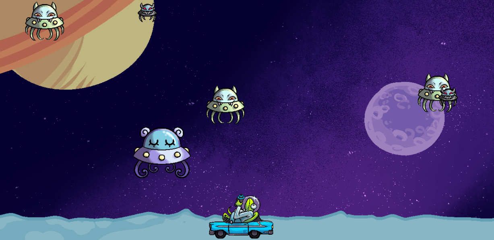

## Table of Contents
- [Controls](#controls)
- [Description](#description)
- [Limitations](#limitations)
- [Lessons Learned](#lessons-learned)
- [Credits](#credits)

## Controls
Move  - Left & Right Arrow Keys 
Shoot - Space Bar

## Description
This browser-based shoot-'em-up was originally programmed in Python using the Pygame library. As my focus has shifted to web development, I've made it playable via browser using WebAssembly. 
[The game can be played on GitHub by clicking this link or the banner,](https://khyleb.github.io/space-meanies/) [or via my website by clicking here.](https://kbest.ca/space-meanies/full-game.html)
  
The original goal of this project was a simple, easy-to-play game that would test my Python knowledge and coding practices. As I've integrated it into an HTML document, it also became an exercize in working with someone else's code, as well as integrating it into my own site.

## Limitations
Although this was a good learning experience, compiling this game for web using PygBag was a more hands-off approach than I usually prefer with my own code. Because I was relying on a library I was not familiar with, my ability to modify the code and control how it displayed on my site was limited. In future projects, planning for possible web integration will be something I initiate at the beginning of a given project. 

## Lessons Learned 
- Interacting with complex code written by another programmer
- Integrating code into a webpage with its own CSS stylesheet, without errors or unintended visual results

## Credits
Original Photo Used for Background:
Music:
Sound Effects:
